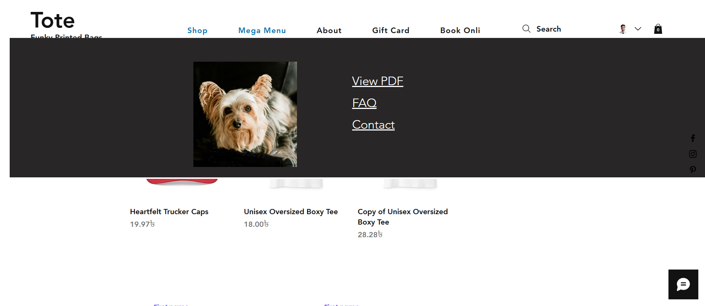

# Wix Mega Menu — Change Image on Mouse Hover using Velo

A simple Wix (Velo) setup for a **mega menu** where hovering over each menu item updates a **preview image** on the right. Built with **Velo events**.

---
### [Watch on YouTube](https://youtu.be/-SObJOaQ--Y)
---

## Preview

> Replace these paths with your actual images.

---

